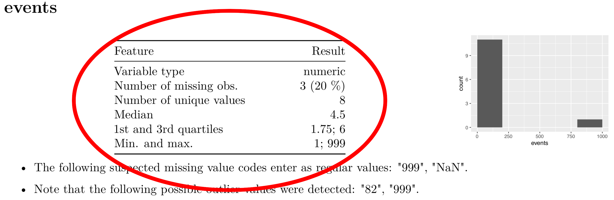
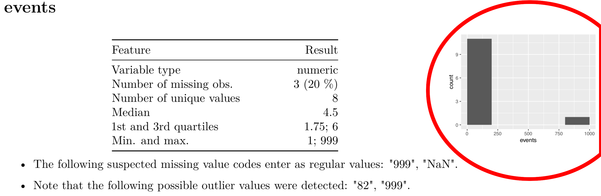
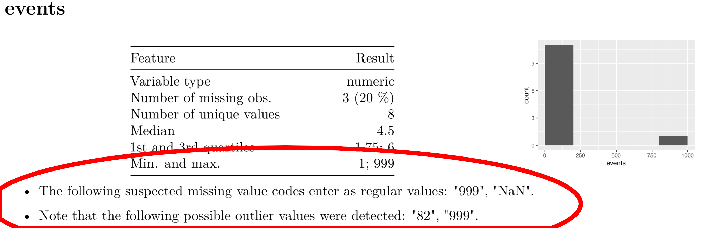

class: animated, fadeIn
layout: true

---


background-image: url(pics/manbeer.jpg)
background-size: 100%
class: middle, center

# The RESCueH project

```{r setup, include=TRUE, echo=FALSE, warning=FALSE, message=FALSE}
#library(knitr)
options(htmltools.dir.version = FALSE, cache=TRUE)
knitr::opts_chunk$set(dev.args=list(bg="transparent"), fig.width=16, fig.height=7)
source("kutheme.R")
```


---

class: center

# Timeline follow back

```{r, echo=FALSE}
DF <- data.frame(day1=sample(1:25, 6),
                 day2=c(NA, NA, sample(1:25, 3), 88),
                 day3=c(NA, 99, 40, sample(1:25, 3)))
head(DF, 4)
```


---

class: center

# Timeline follow back

```{r, echo=FALSE}
head(DF, 6)
```

---

class: center

# Monthly Alcohol units


```{r echo=FALSE,message=FALSE, warning=FALSE, error=FALSE}

tlfb <- data.frame(units=dget("tlfb.txt"))

p <- ggplot(tlfb, aes(units)) + geom_dotplot() +
     xlab("Units") + ylab("Frequency") + 
     theme_xkcd()+
    theme(
        axis.text.y = element_blank(),
      axis.ticks = element_blank()) 
p
```


---

# Reproducible research

What **didn't** we check?

--

- Many studies cannot be replicated: time, money, unique
- New technologies increase data sizes
- Merge existing databases into megadatabases
- Genetic data for future analyses

--

## You are your worst collaborator.


---


# Design idea for dataMaid


*   Aid researchers in identifying problems that we didn't consider.
*   Ensure that everything you checked (and **didn't check**) is documented.
*   Enable collaborations with non-statisticians.


dataMaid is **not** 

*   a cleaner
*   a formal rule validator

Documentation to be **read** and **evaluated** by a human.

---

# Three steps of data quality assessment

Loops through the columns of a `data.frame` and performs 3 steps:

1.  **Summarize**: Simple summary statistics – what’s in the
variable?
2.  **Visualize**: Look at the distribution of the variable – is the distribution as expected?
3.  **Check**: Look for specific problems – is the variable valid?

What summaries/visualization/checks are relevant depends on the
*class* of the variable.

---

# Summarize

```{r echo=FALSE}

```


---

# Visualize

```{r echo=FALSE}

```


---

# Check

```{r echo=FALSE}

```


---

class: inverse, middle, center

# Example time

---

# dataMaid and US presidents

Install (from dev or CRAN)

```{r eval=FALSE}
devtools::install_github("ekstroem/dataMaid")
```

```{r}
library("dataMaid")
data(bigPresidentData)
bpd <- bigPresidentData  # Save on typing
dim(bpd) 
```

---

# The one-liner workhorse ...

```{r eval=FALSE}
makeDataReport(bpd)
```

---

# ... or the multi-argument version

```{r eval=FALSE}
makeDataReport(bpd,
  output = "html",  # Or "pdf" or "word"
  onlyProblematic = TRUE, # only list problems
  mode = c("check", "visualize"), # Tasks to perform
  replace = TRUE, # Overwrite existing output
  visuals = setVisuals(all = "basicVisual"),
  # Checks for numeric
  checks = setChecks(numeric = "identifyOutliers"), 
  reportTitle = "Very nice report",
  maxProbVals = Inf, # How many problematic values to show
  # Use numeric checks for complex class/variables
  treatXasY = list(complex = "numeric")) 
```

---

# Interactive use

All summary/visual/check functions can be used interactively too:

```{r}
identifyMissing(bpd$presidencyYears)
str(identifyMissing(bpd$presidencyYears))
```

---

# Custom checks

```{r}
# Show the reference category
refCat <- function(v, ...) {
    val <- levels(v)[1]
    summaryResult(list(feature = "Reference category",
    result = val,
    value = val))
}
```

Then run

```{r eval=FALSE}
makeDataReport(bpd, summaries=
    setSummaries(factor = defaultFactorSummaries(add = "refCat"))) #<<
```


---

# Codebooks

Use `dataMaid` to generate a codebook.

```{r eval=FALSE}
makeCodebook(bpd)
```

Useful for documenting checked/cleaned data.

---

# More information 

*   Article on JSS

*   Vignette about how to make custom extensions:

```{r eval=FALSE}
vignette("extending_dataMaid")
```
    
*   Early (pre-alpha?) version of Shiny app

```{r eval=FALSE}
library("shiny")
runUrl("http://biostatistics.dk/dataMaid/app.zip")
```

---

class: inverse, middle, center

# Thanks!
